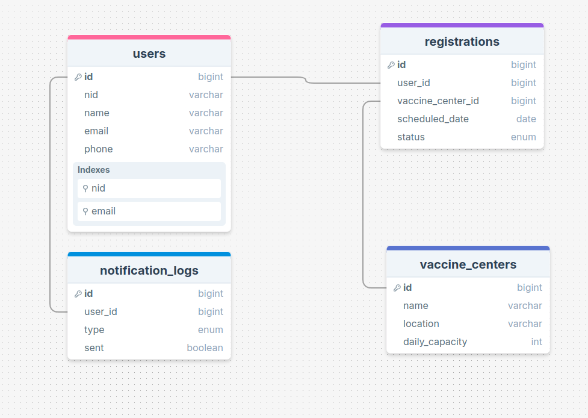
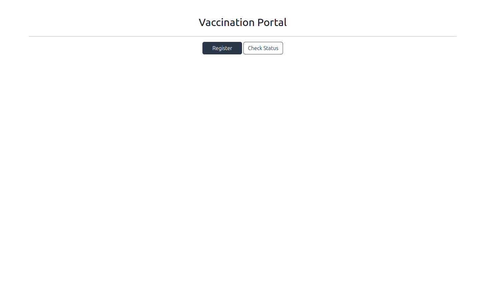
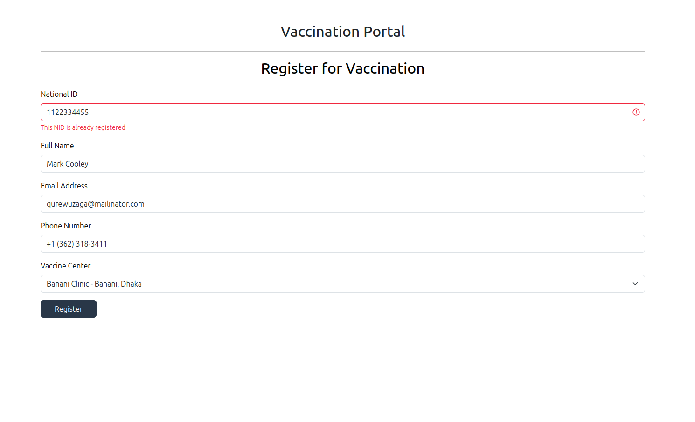
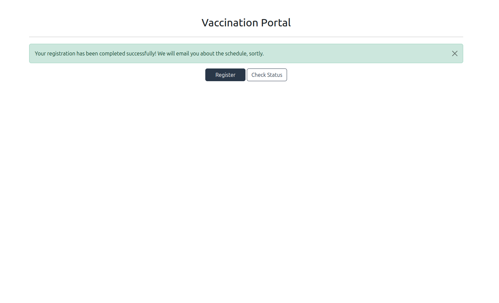
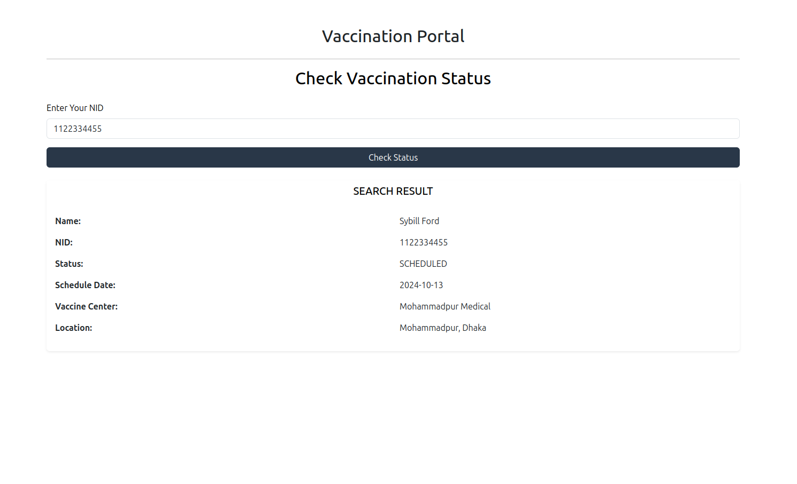

## Documentation

### Description
Designed and developed a COVID vaccine registration system using Laravel and Blade, based on specified requirements. Containerized the application for streamlined deployment and scalability. The system allows users to register for vaccination, select vaccine centers, and receive automated email notifications. Scheduling is handled dynamically, considering daily limits for each center, and ensures first-come, first-served order while avoiding weekends.

### Note
For this setup we keep our `.env` and `docker-compose.yml` file on git to simplified project installation process, if you want to deploy anywhere please adjust credentials.

## Prerequisites
- [Docker](https://www.docker.com/get-started)
- [Docker Compose](https://docs.docker.com/compose/install/)
- Ubuntu or MacOs (Our install.sh file is supported for those os)

## Setup
1. Clone the repository:
    ```sh
    git clone https://github.com/azonedev/temp-tst.git
    ```
2. Navigate to the project directory:
    ```sh
    cd [project directory]
    ```
3. Run the installation script:
    ```sh
    sudo chmod +x install
    sudo ./install
    ```
4. Verify that your container is all of the container is up and running with `docker-compose ps`
   
## Live Ports
- Application: `http://localhost:8885`

For database database, redis check the root `.env` file

## Technical Docs

### Tech stack 
- Docker (Containerization) services:
  - `app` PHP-8.3 for application
  - nginx as a server
  - database (postgres)
  - redis for processing queue
  - worker as a worker with enabling corn handler
  - mailpit for testing emails locally
- Laravel 10x
- UI (Blade) with bootstrap

  
### Project Structure
The project structure is organized as follows:

```sh
root
├── .data                # Docker volume data local sync  
├── .docker              # Docker-specific configurations
├── app/                 # Backend(Laravel) application files
│   └── ...
├── .dockerignore        # Docker ignore rules
├── .env                 # Environment variables 
├── docker-compose.yml  # Docker Compose file
├── README.md            # Setup guide and project docs
```

### Schema Overview: 



### Command for notifier

  - Make a command to notify users before the night of the scheduled date.
  - The command added to `scheduler` from `console kernel` and our docker worker is already configured to run corn job.
  - Didn't modified the default timezone because the requirement didn't suggest any specific timezone.
  - The command `app:schedule-reminder-notification`


### If we want to notify users with SMS

Then, simple add code for sending SMS 
on `ProcessScheduleReminderJob`s `TODO` section

### Improvements for faster Search and Registration

  - `DONE:` Indexed email and nid for faster look that will help us to faster look up on registration and search 
  - `TODO:` For much record we can store registration info on redis with hash structure, where the key will be `NID` and the value will have what we need on search page. 

## UI 




